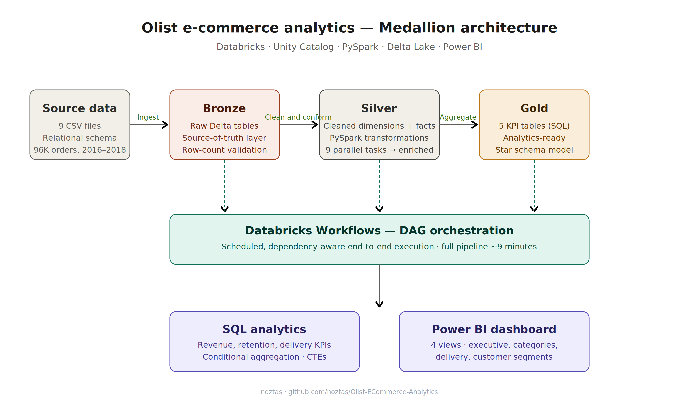
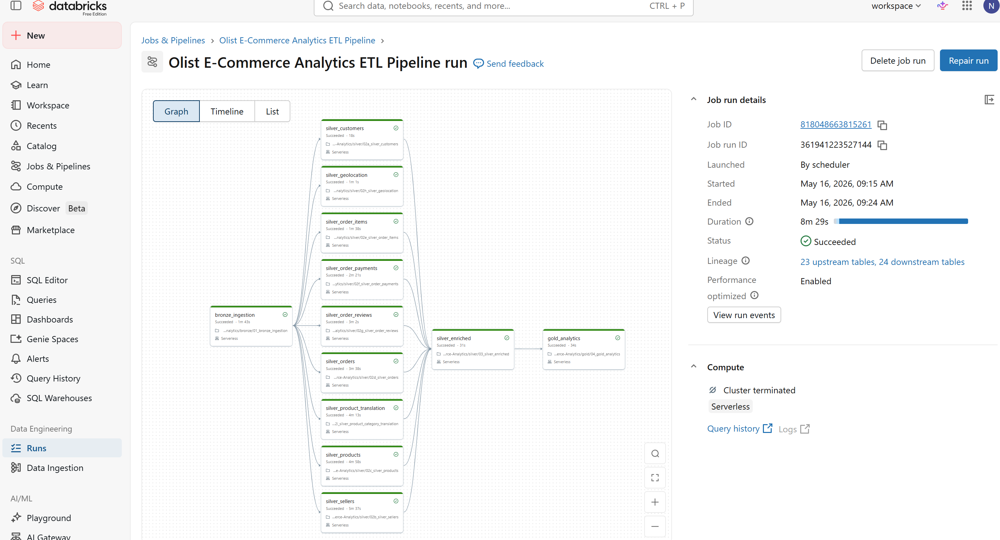
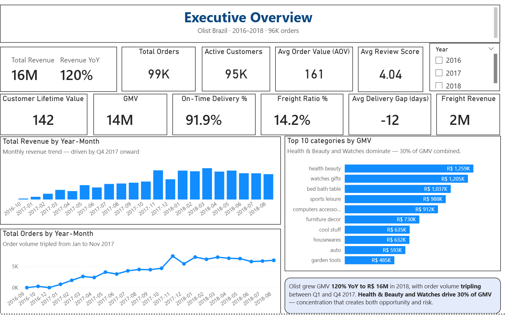
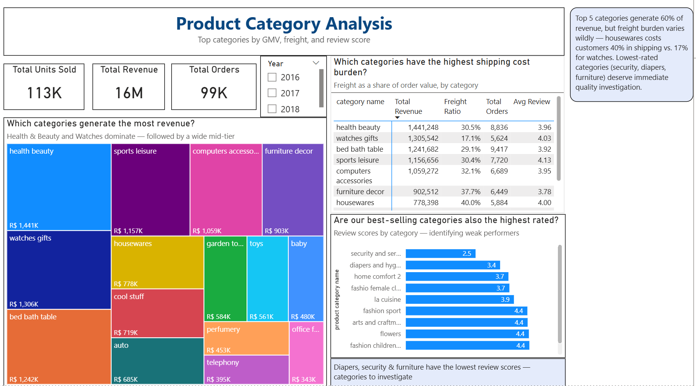
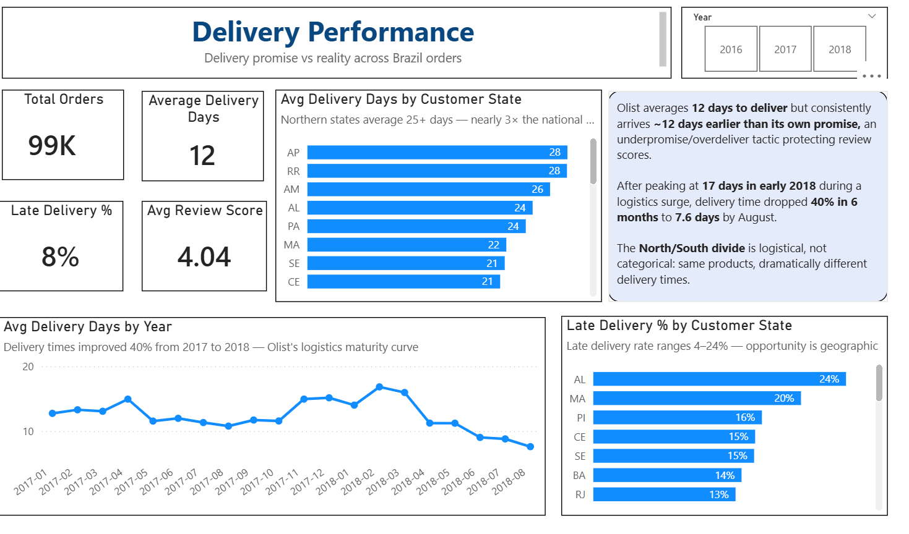
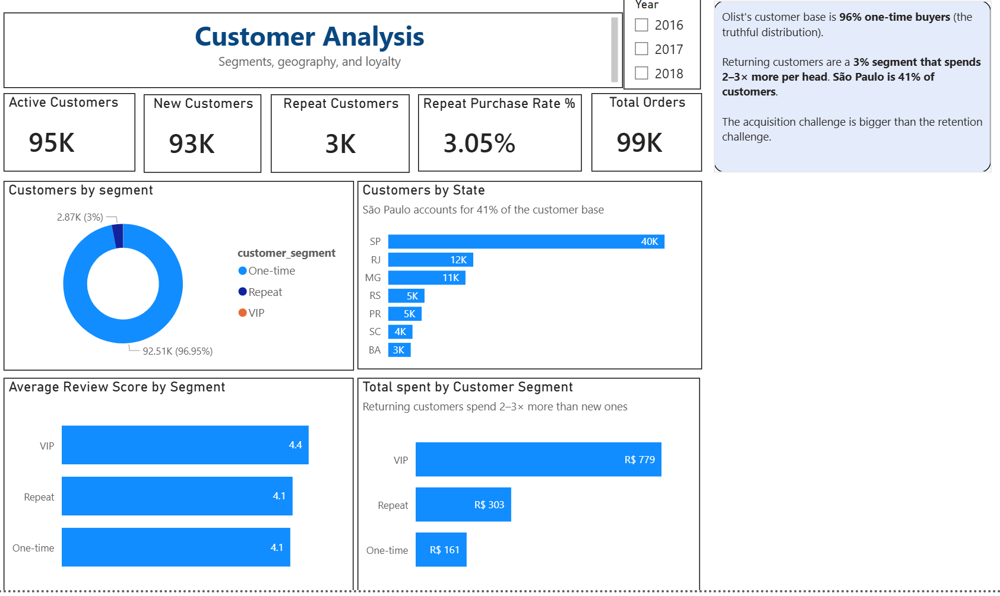
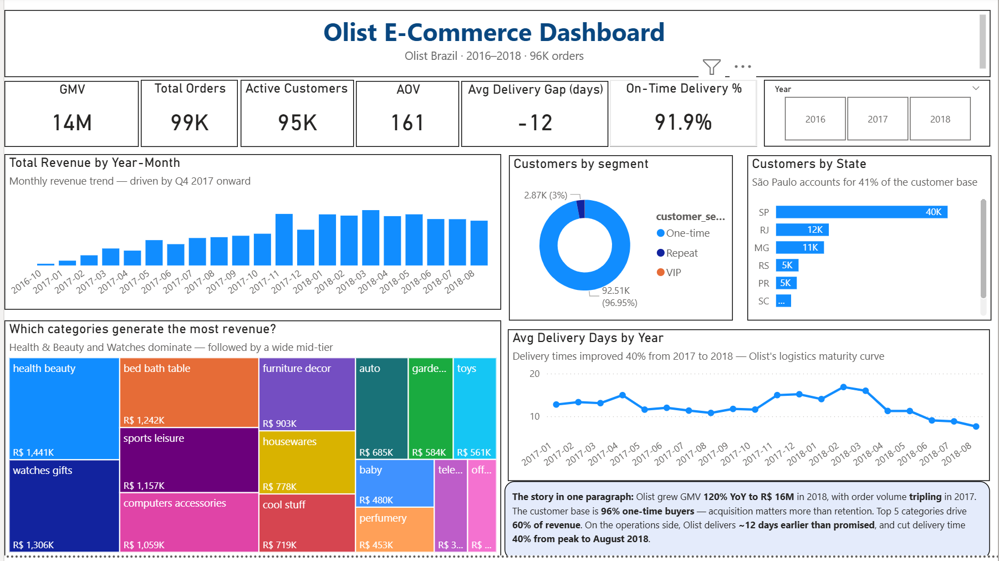

# Olist E-Commerce Analytics

I took 100K+ real e-commerce transactions, built a Medallion data pipeline in Databricks, and turned raw CSVs into a dashboard that answers: **Where's the money coming from? Are we shipping on time? And why aren't customers coming back?**

**Stack:** Databricks · PySpark · SQL · Delta Lake · Unity Catalog · Power BI

---

## What I Found

These are real findings from real data — the kind of insights that drive business decisions.

💰 **Revenue is growing fast, but it's concentrated.** Olist grew 120% YoY to R$ 16M. But Health & Beauty and Watches alone drive 30% of all revenue. Top 5 categories account for 60%. That's growth built on a narrow foundation.

🚚 **Deliveries are early — on purpose.** Average delivery takes 12 days, but orders consistently arrive ~12 days before the promised date. Olist is underpromising to protect review scores. Smart tactic, but northern states (AP: 28 days) still wait twice as long as São Paulo.

👤 **Almost nobody comes back.** 96% of customers buy exactly once. The 3% who return spend 2–3× more per order and rate higher. This marketplace has an acquisition engine but no retention strategy.

📦 **Some categories have a quality problem.** Security products average 2.5 stars. Diapers: 3.4. Housewares ship at 40% freight ratio — customers pay almost as much for shipping as for the product.

---

## What I'd Recommend

- **Fix logistics in northern states** — AP, RR, AM wait 25+ days
- **Audit low-rated categories** — security (2.5★) and diapers (3.4★) need investigation
- **Build a retention program** — the 3% repeat segment is 3× more valuable
- **Reduce freight burden** on housewares and furniture (35–40% freight ratio)

---

## Architecture

> Raw CSVs → Bronze (raw Delta) → Silver (cleaned) → Silver Enriched (joined) → Gold (KPIs) → Dashboard



*Conceptual flow: each layer has a distinct responsibility, with Databricks Workflows orchestrating the full pipeline end-to-end.*
```
Raw CSVs → Bronze (raw Delta) → Silver (cleaned) → Silver Enriched (joined) → Gold (KPIs) → Dashboard
```



*9 Silver tasks run in parallel, funnel into one enriched table, then produce 5 Gold KPI tables. Full pipeline: ~9 minutes.*

**Why this structure?** If a number looks wrong in the dashboard, I trace it back: Gold → Enriched → Silver → Bronze → raw CSV. Every transformation is documented and reproducible.

---

## Dashboard

### Executive Overview


### Product Categories


### Delivery Performance


### Customer Segments


### Summary


---

---

## 🧪 A/B Test: Can We Bring One-Time Buyers Back?

The dashboard told me 96% of Olist customers buy exactly once. The obvious next question: can we do anything about that? So I built an A/B test to find out — using the real customer base from the silver layer.

**The test idea:** Send a 10%-off coupon email to one-time customers who've been quiet for 60–180 days. Half get the email, half don't. Did the email actually bring people back, or were they coming back anyway?

### How I set it up

| Stage | What I did |
|---|---|
| Hypothesis | Wrote down what I'm testing before touching the data — so I couldn't move the goalposts later |
| Sample size | Figured out the test needs 6,005 customers per group to reliably detect a 1pp lift (α=0.05, power=0.80) |
| Sampling | Pulled 25,340 eligible one-time customers from `orders_enriched`, randomly picked 12,010 |
| Assignment | 50/50 split with a fixed random seed so the test is reproducible |
| Sanity checks | Chi-square SRM (was the split actually 50/50?) and a t-test on `days_since_last_order` (were both groups similar before the test?) |
| Simulation | Generated outcomes from known true parameters so I could verify my analysis actually finds the effect |
| Analysis | Two-proportions z-test, 95% Wilson CI on the lift, t-tests on the AOV and review-score guardrails |

### What I found

| | Control | Treatment | Result |
|---|---|---|---|
| 30-day repurchase rate | 3.58% | 4.63% | **+1.05 pp**, 95% CI [+0.34, +1.76], p = 0.0038 |
| Average order value | R$ 149.32 | R$ 151.42 | +1.41% — no harm |
| Review score | 4.15 | 4.16 | Both above 4.0 — no harm |

**Verdict: SHIP.** The coupon brought about one extra customer back per 100 sent. Not huge, but real — and it didn't cost margin or review scores.

What I'd watch after launch: some of that lift might be people who'd have bought anyway, just sooner. A proper holdout group kept out for 90 days would tell us how much of the +1pp is true new revenue versus pulled-forward demand.

Full scorecard: [`experiments/results/01_email_coupon_scorecard.md`](experiments/results/01_email_coupon_scorecard.md)
Notebook: [`experiments/01_ab_test_email_coupon.py`](experiments/01_ab_test_email_coupon.py)

---

## How It's Built

### The Pipeline (Databricks + PySpark + SQL)

**Bronze:** 9 CSVs loaded as Delta tables. No transformations — raw data preserved as source of truth.

**Silver:** Each table cleaned individually. Consistent patterns across all notebooks:
- Dynamic string trimming using schema inspection (no hardcoded column lists)
- Null normalization — converts garbage strings ("N/A", "null", "") into true database NULLs
- Type casting — monetary columns to DECIMAL(10,2), review scores from string to integer
- Validation flags — timeline checks, price validation, delivery classification
- Feature engineering — delivery time, approval speed, freight ratio, late delivery flag

**Silver Enriched:** 7-table JOIN in SQL. Payments and reviews pre-aggregated to one row per order before joining — without this, row count would explode from 112K to 300K+.

**Gold:** 5 business KPI tables written in SQL with conditional aggregation, CTEs, and NULLIF-safe division.

### The Dashboard (Power BI)

Built on a hybrid model — KPI cards use DAX measures against the enriched table for dynamic filtering, while charts read from pre-aggregated Gold tables for fast rendering. DateTable dimension enables proper time intelligence (YoY, MoM).

---
## Project Structure

```
├── 01_bronze_ingestion              # Infrastructure + raw CSV → Delta
├── 02a–02i_silver_*                 # 9 cleaning notebooks (parallel)
├── 03_silver_enriched               # 7-table JOIN
├── 04_gold_analytics                # 5 business KPI tables
├── 05_pipeline_orchestration        # Databricks Workflow DAG
├── experiments/
│   ├── 01_ab_test_email_coupon      # A/B test: email coupon for one-time buyers
│   └── results/
│       └── 01_email_coupon_scorecard.md
├── Olist_Dashboard.pbix             # Power BI dashboard
├── screenshots/                     # Pipeline + dashboard images
└── README.md

```

## Dataset

Olist Brazilian E-Commerce — 8 relational tables, 100K+ real transactions, Sep 2016 – Oct 2018.

---

## Tech Stack

| Tool | Used For |
|---|---|
| Databricks | Unity Catalog, Delta Lake, Workflows |
| PySpark | Silver-layer transformations |
| SQL | Enriched JOINs + Gold analytics |
| Power BI | Dashboard with DAX measures |
| Delta Lake | ACID storage, schema enforcement |
| GitHub | Version control |
| scipy + statsmodels | Power analysis, z-test, confidence intervals for A/B testing |

---

## What I'd Change for Production

- Replace inferSchema with explicit schemas
- Add automated data quality tests with alerting
- Switch from full overwrite to incremental merge/upsert
- Partition large tables by date
- Split the A/B test into three scheduled jobs (assign, monitor daily, analyze at end) so we can run many tests in parallel

---

## About Me

**Neslihan Oztas Ates** · Data Analyst · Ingolstadt, Germany

I trained as a biologist and discovered that what I loved most about science was the data — designing experiments, analyzing results, finding patterns. So I went all-in on analytics.

[LinkedIn](https://www.linkedin.com/in/neslihanoztas/) · [Portfolio](https://noztas.github.io/Portfolio-Website/) · [GitHub](https://github.com/noztas/) · neslihanoztas1@gmail.com
